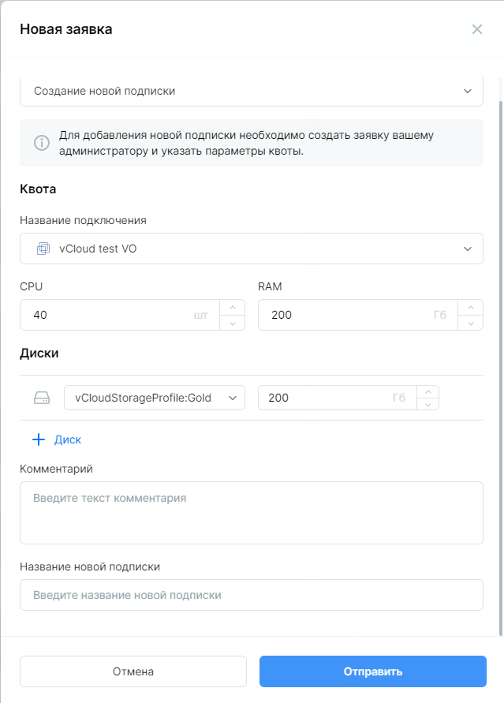
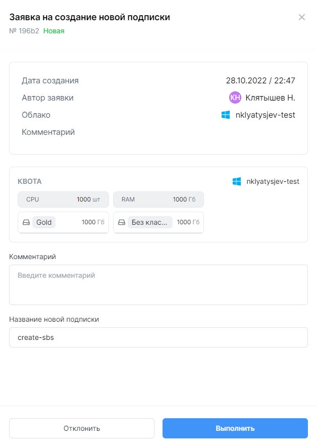
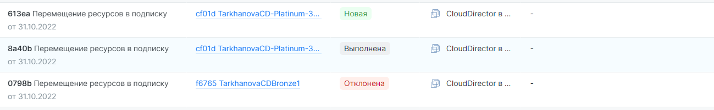
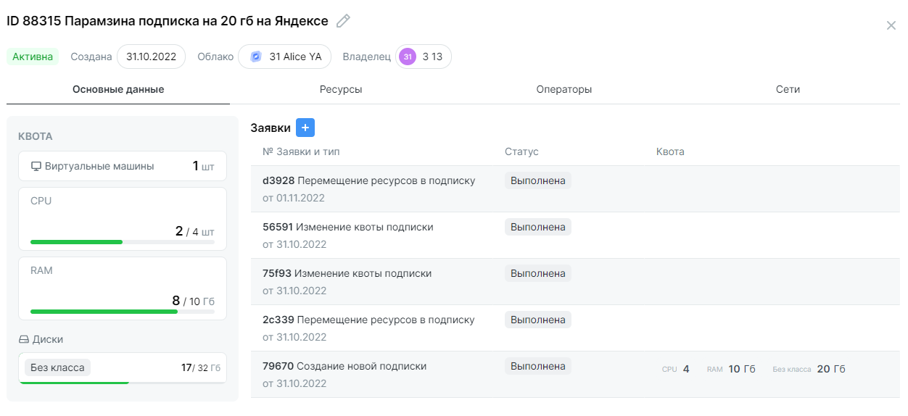

# Создание подписки

## Создание заявки

!!! Права
	Для выполнения действий потребуются права `Глобального администратора` или `Владельца` подписки. 
 
В разделе ***Заявки*** выберите ***Создать заявку*** и тип `Создание новой подписки`. Заполните необходимые поля и укажите желаемый объем квоты вычислительных ресурсов CPU, RAM и дисковое пространство. Для Hyper-V и Cloud Director можно указать отдельно квоты для разных типов дисков.

 
Все заявки должны получить согласование `Глобального администратора`, в том числе если заявку создал сам `Глобальный администратор`.

## Согласование или отклонение заявок

`Глобальный администратор` видит поступившие заявки в разделе **Заявки** в статусе ***Новая***. При клике на строку заявки открывается модальное окно с кнопками ***Выполнить*** и ***Отклонить***. Заявка в таблице `Глобального администратора` и заявителя поменяет статус на **Выполнена** или **Отклонена** соответственно.
 

История заявок, связанная с подпиской, отображается в карточке подписки. Открыть карточку можно в разделе **Подписки** при клике на подписку.

!!! Внимание
	При оформлении и согласовании заявок обратите внимание, что при подключении в облаке могут быть установлены максимальные объемы дискового пространства для разных типов дисков. В случае, если дисковое пространство уже распределено между подписками, Clouder не даст создать подписку с квотой, превышающей остаток пространства.
