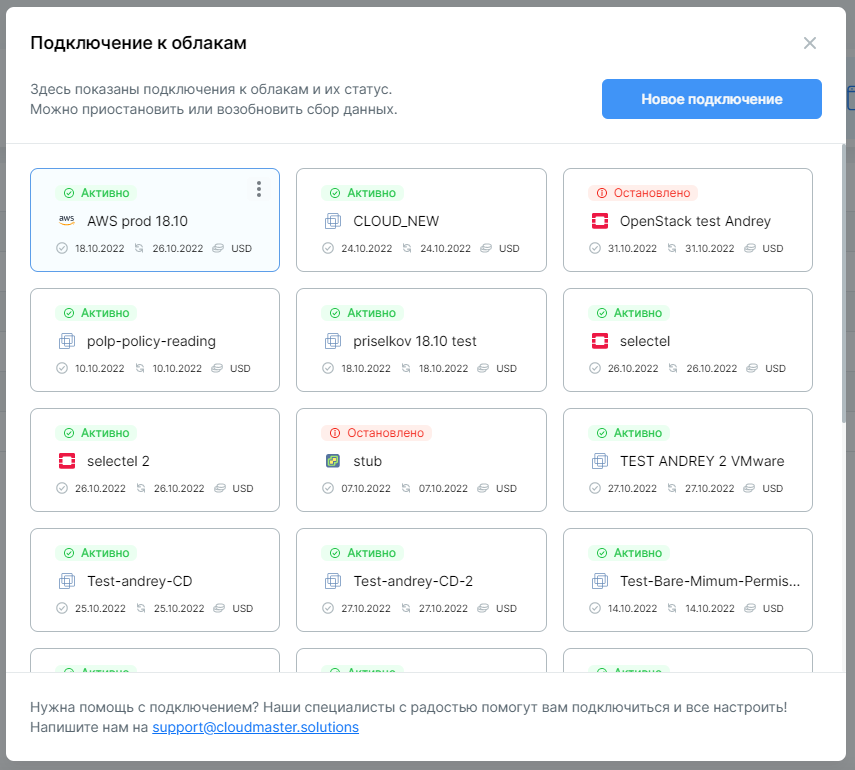
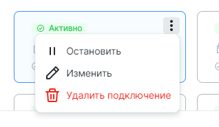
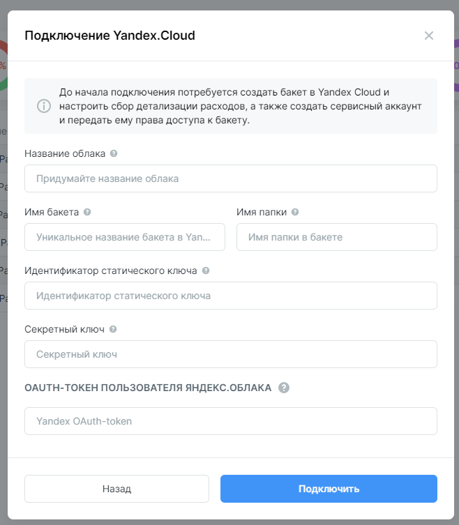
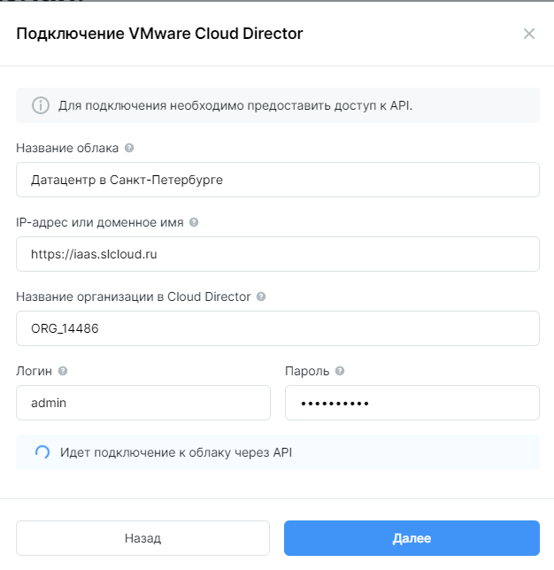
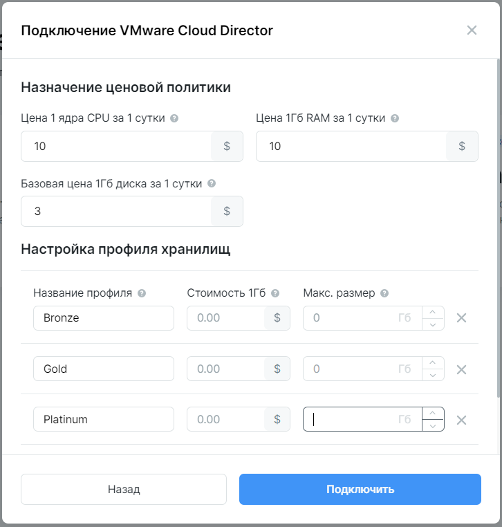

#Управление подключениями облаков

##Общий принцип подключения и управления

Все операции с подключением осуществляются в меню **Подключение к облакам**. В правом верхнем углу кликните на :gear:, выберите пункт **Подключение к облакам**.

В открывшемся окне отображается список существующих подключений. Указана информация о ***дате создания*** подключения (общая информация), ***дате обновления*** информации по потреблению и ***валюте*** расчетов (используется в модуле Coster).

Для создания подключения кликните **Новое подключение**.

!!! Внимание
    Подключение осуществляется обязательно для модуля Clouder и модуля Coster. Отсутствие данных для одного из модулей будет приводить к ошибкам. 

    В связи с этим в меню подключений облаков будет необходимо задать данные для расчетов по затратам или получению их из облака, хотя эти данные используются модулем Coster.

**Действия с подключениями**

Меню действий с подключением появляется при наведении курсора на карточку подключения — в виде иконки :fontawesome-solid-ellipsis-vertical:. Кликните, чтобы отобразать доступные опции: 

- **Остановить** — прекращает доступ Clouder по предоставленным данным доступа к облаку. 
- **Изменить** — позволяет отредактировать данные подключения.
- **Удалить подключение** — удаляет данные доступа к облаку, а также все данные, собранные за время подключения к облаку. Действие относится только к данным в Cloudmaster.

Подключение Clouder к облаку можно остановить. 

!!! Внимание

    Остановка подключения Clouder ***НЕ*** ведет к изменениям в облаке. Все ресурсы продолжат работу в штатном режиме.

    После остановки подключения Clouder перестанет собирать информацию об инфраструктуре. Пользователи Clouder потеряют возможность управлять виртуальными машинами через интерфейс Clouder.

##Особенности подключения Яндекс Облака

Функциональность управления Яндекс Облаком имеет следующие неизменяемые параметры:

- управление машинами только в зоне доступности ***[ru-central1-a]***,
[ru-central1-a]: https://cloud.yandex.ru/docs/overview/concepts/geo-scope
- создание машин только с сетями из зоны доступности ***ru-central1-a***,
- все машины создаются на платформе ***[Intel Broadwell]***,
[Intel Broadwell]: https://cloud.yandex.ru/docs/compute/concepts/vm-platforms
- при создании дополнительного диска применяется тип диска [HDD],
[HDD]: https://cloud.yandex.ru/docs/compute/concepts/disk
- загрузочный диск можно удалить только вместе с машиной (отсоединить нельзя),
- нет функции создания контрольной точки для машины.

Для подключения Яндекс Облака требуются данные двух аккаунтов: пользователя Яндекс Облака для модуля ***Clouder*** и сервисного аккаунта для модуля ***Coster***. В текущей реализации необходимы настройки и данные обоих аккаунтов. 

??? "Набор прав для Clouder"
    Пользователь, от лица которого будет осуществлять действия Clouder, должен обладать доступом к нужным облакам и каталогам (структурным единицам Яндекс Облака), а также иметь права, необходимые для выполнения действий с машинами и дисками. 

Нужно выбрать или создать пользователя Яндекс Облака, от лица которого ***Clouder*** будет осуществлять действия с ВМ, и создать OAuth-токен. Для этого необходимо залогиниться в Яндекс Облако под выбранным пользователем и следовать инструкции в [документации]. 
[документации]: https://cloud.yandex.ru/docs/iam/concepts/authorization/oauth-token

??? "Набор прав для Coster"
    Требуется предоставить доступ к бакету и папке, куда сохраняются биллинговые записи. Доступ к учету биллинга настраивается при помощи сервисного аккаунта. Проверьте, что у вас есть одна из ролей: `billing.accounts.owner`, `billing.accounts.admin`, `billing.accounts.editor`.

2. Создать бакет и папку, настроить сбор данных биллинга. Ссылка на [документацию]. 
[документацию]: https://cloud.yandex.ru/docs/billing/operations/get-folder-report
3. Создать сервисный аккаунт, предоставить данные к папке с биллингом и создать статический ключ (требуется идентификатор и значение). Ссылка на [документацию].
[документацию]: https://cloud.yandex.ru/docs/iam/concepts/authorization/access-key

Все поля формы обязательны для заполнения.

##Особенности подключения VMware Cloud Director

Поключение состоит из двух шагов: 1) подключение к API и 2) настройка параметров учета затрат. В текущей версии продукта необходимо заполнение информации на обоих шагах, даже если вы не планируете пользоваться модулем ***Coster***.

Стандартная модель авторизации в Cloud Director предполагает адрес размещения, название организации в Cloud Director и данные аккаунта. Рассмотрим на примере: 

`https://iaas.slcloud.ru/tenant/ORG_14486/` 

В данной строке: 

`https://iaas.slcloud.ru` — адрес API, а `ORG_14486` — название организации в Cloud Director.

Если проверка подключения прошла успешно, откроется второй шаг. В открывшейся форме необходимо заполнить данные: 

- цена за ядро CPU в рабочей машине за сутки, 
- цена за Гб RAM в рабочей машине за сутки, 
- цена за Гб хранилища, прикрепленного к рабочей машине в сутки. 

Цены указываются в валюте тенанта. Валюта определяется на этапе создания тенанта сотрудником Cloudmaster. 

Модули продукта могут различать типы дисков Cloud Director (storage policy). На втором шаге предлагается вариант добавить тип диска вручную — заполнить название, которое должно полностью соответствовать названию на стороне Cloud Director, или запросить данные у провайдера. При запросе данных у провайдера Cloudmaster автоматически подятнет типы дисков из Cloud Director. 

Необходимо заполнить значения цены для каждого типа. Clouder позволяет установить максимальный размер хранилища каждого типа для подключения. В дальнейшем Clouder будет ориентироваться на указанный объем хранилища и не позволит администраторам создать подписки превышающие в сумме объем по каждому из типов дисков.

!!! Консоль

    Подключение к консолям машин потребует организации сетевой связности. Специалисты Cloudmaster готовы оказать поддержку для настройки подключения. 

