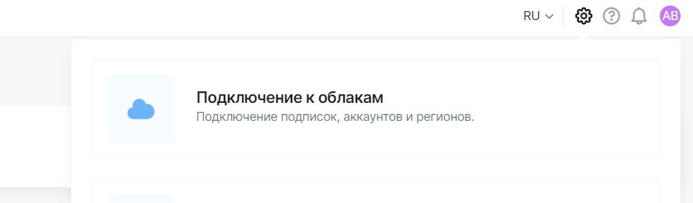
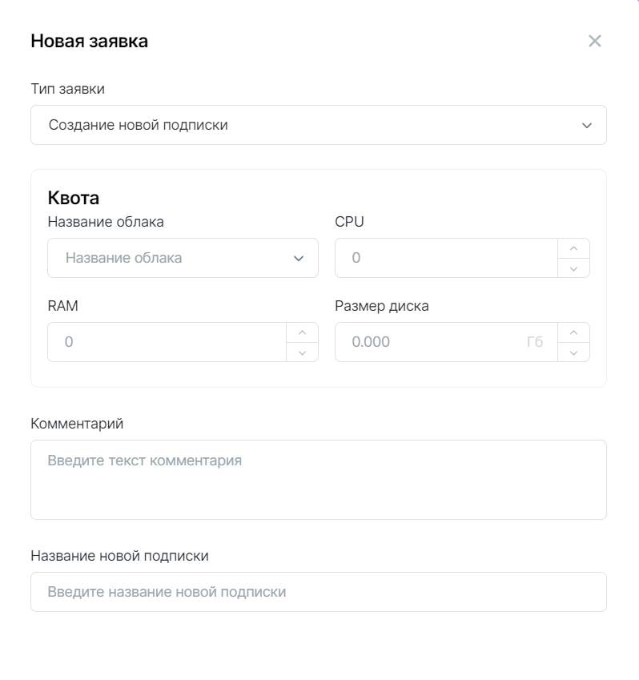
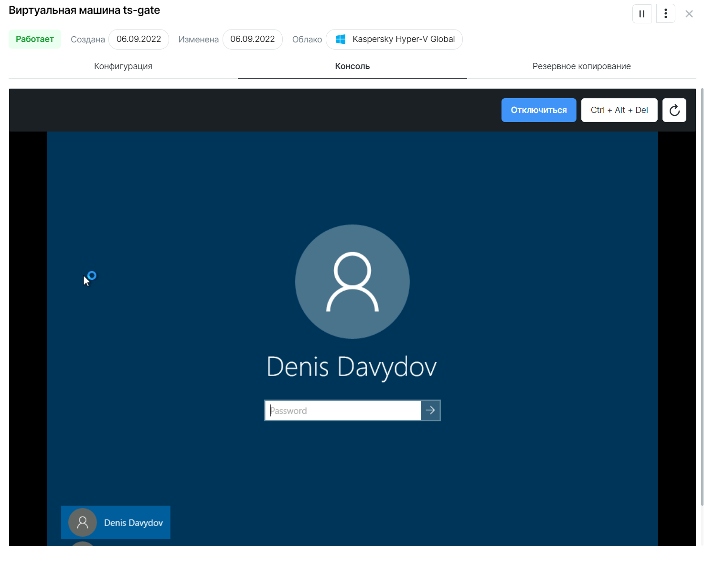

# Начало работы

## Подключение облаков

Подключите вашу приватную или публичную систему виртуализации к Clouder. После подключения будет запущен процесс сканирования ресурсов: сетей, машин и дисков.

Авторизуйтесь в Cloudmaster в роли `Глобального администратора`. Кликните на :gear: в правом верхнем углу, выберите пункт **Подключение к облакам** и далее —  необходимый вариант виртуализации. 

Далее, все подключённые системы виртуализации будут иметь внутренний термин *Облако Clouder*.

Для каждой системы виртуализации будет предложено заполнить необходимые авторизационные данные.

После успешной аутентификации начнётся процесс сканирования инфраструктуры и загрузки виртуальных машин в раздел **Ресурсы**. 
Список виртуальных машин подгрузится в течение 5-10 мин.

## Создание пользователей

В продукте реализована ролевая модель:

-	**Глобальный администратор** — пользователь с максимальными правами и доступом ко всем настройкам, разделам и возможностям продуктам.
-	**Владелец** — имеет права на управление *Подписками* и может создавать *Заявки* на создание, изменение, удаление и прочие операции с ними, а также управлять ВМ внутри Подписок и составом пользователей, имеющих доступ к ней.
-	**Оператор** — пользователь, имеющий возможность создавать и управлять ВМ внутри доступной Подписки, у которых он является ответственным.

> Глобальный администратор может управлять существующими пользователями и создать нового в
> разделе **Пользователи и роли** (:gear: в правом верхнем углу). 

Новому пользователю на почту будет направлен временный пароль для доступа к Clouder.
Пользователи могут самостоятельно изменить свой пароль, нажав на аватарку в правом верхнем углу. Пароль должен соответствовать требованиям сложности:

- не менее 8 символов
- наличие больших и маленьких букв
- наличие цифр
- наличие символов.

## Создание новой подписки

Пользователи с правами `Владелец` или `Глобальный администратор` могут создавать `Подписки` с квотами ресурсов. 

!!! Внимание
    Каждая `Подписка` относится только к одному к Облаку Clouder. Т.е. нельзя объединить ресурсы или объемы из разных подключений.

Создайте `Заявку` с соответствующим типом в разделе **Заявки** и укажите нужные объемы квоты ресурсов.

`Глобальный администратор` получит *Заявку* и сможет ее согласовать или отклонить. Если заявка согласована, `Подписка` будет создана и отобразится в разделе **Подписки**.

`Глобальный администратор` должен добавить в подписку сети, в которых разрешено создавать ВМ. Добавить сеть можно в карточке подписки во вкладке **Сети**. 

!!! Важно
    Добавьте в подписку сети, чтобы пользователи могли создавать машины. Проверьте соблюдение следующих условий:

    - сеть должна быть активна в разделе **Ресурсы** -> **Сети**,

    - сеть должна присутствовать в облаке Clouder, на основе которого, создана подписка.

## Настройка подписки

После согласования заявки `Владелец` подписки увидит подписку в разделе **Подписки**. В карточке подписки `Владелец` может добавить `Операторов`, из числа пользователей тенанта Cloudmaster. `Операторы`, добавленные в подписку смогут использовать квоты ресурсов для создания ВМ. Добавление производится во вкладке **Операторы**.

!!! Внимание
    Убедитесь, что в подписке есть сети. Добавить сеть для создания машин может только `Глобальный администратор`. Без сети машины создаваться не будут.

## Изменение подписки

Квоту в `Подписке` можно увеличть или уменьшить. Изменение производится через заявку с типом `Изменение квоты подписки`.

После рассмотрения и согласования `Заявки` `Глобальным администратором` в `Подписке` изменится квота ресурсов, доступная для создания новых и изменения прежних ВМ.

!!! Внимание
    Изменение квоты производится с учетом установленных лимитов и текущего распределения ресурсов в облаке. Если лимит по какому-либо ресурсу исчерпан, система не даст увеличить квоту. Лимиты устанавливливаются при подключении облака. 

Удаление `Подписки`производится через `Заявку` с типом `Удаление подписки`.

!!! Внимание
    Удалить можно только пустую `Подписку`, в которой нет ресурсов. 

Удалить ВМ можно из карточки ВМ, кликните на :fontawesome-solid-ellipsis-vertical:. Также ВМ можно переместить в другую доступную `Подписку` через заявку `Передача ресурсов из подписки в подписку`. 

`Заявка на перемещение` может относиться ко всем ВМ в подписке: укажите `Подписку-источник`, кликните **+ Ресурсы**, выбрать все ВМ, а также указать Подписку-назначение.

## Создание ВМ

Пользователь может создать ВМ только в тех `Подписках`, которые доступны пользователю. А также при условии доступности свободных ресурсов в подписке. Определить сколько ресурсов доступно можно по статус барам в карточке `Подписки`.

ВМ можно создать с пользовательской конфигурацией или использовать подготовленный `Глобальным администратором` `Шаблон`.

Создание ВМ занимает некоторое время. Когда машина будет создана, в Уведомлениях (колокольчик справа вверху), появится соответствующее сообщение.

## Изменение существующих ВМ

В разделе **Ресурсы** -> **Виртуальные машины** пользователь может видеть список, доступных ему ВМ. При клике на строку открывается карточка ВМ.

Для редактирования параметров CPU, RAM, Сети - нажмите карандаш в углу карточки.

Для изменения/удаления диска, наведите на виджет с ним и нажмите :fontawesome-solid-ellipsis-vertical: и выберите действие — **Удалить** или **Оптимизировать**.

Запуск и остановка ВМ также производятся через карточку (кнопка справа в углу).

Для каждой ВМ можно назначить **Ответственного**. Это пользователь, который будет иметь доступ к управлению и изменению ВМ. Выбирается из `Операторов`, добавленных в выбранную `Подписку`. 

??? "Как назначить ответственного за ВМ"
    Перейдите в раздел **Подписки**. Откройте карточку подписки, где находится ВМ.
    Во вкладке *Ресурсы* в карточке машины выберите чекбоксом необходимые ВМ. Нажмите на **Назначить ответственного**. 

> Ответственный назначается автоматически, при создании ВМ. В дальнейшем его можно изменить.

## Подключение к ВМ

К виртуальной машине можно подключиться прямо из браузера, выбрав вкладку **Консоль** в карточке ВМ и нажав **Подключиться**. Доступно подключение по RDP или через SSH.

*Для корректной работы подключения к ВМ необходимо дополнительно настроить корректную сетевую связность. Обратитесь к команде Cloudmaster за деталями.*

