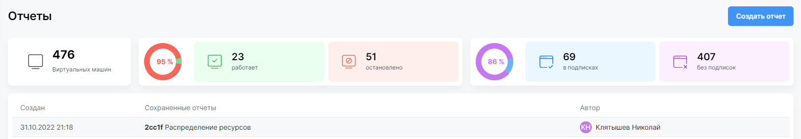

# Отчеты по использованию

Раздел **Отчеты** содержит общую информацию по машинам в подключенных облаках и позволяет создавать пользовательские отчеты по облакам и подпискам.

## Общие показатели по облаками

`Глобальный администратор` может видеть виджеты с основными показателями по работе машин в облаке. 

*Рекомандуем обратить внимание на виджет с машинами без подписок. Такие машины не учтены в подписках, у них нет ответственного и управлять ими может только `Глобальный администратор`*. 

## Отчеты по облакам и подпискам

`Глобальный администратор` и `Владелец` могут создавать и просматривать отчеты по текущему использованию ресурсов в подписках.

