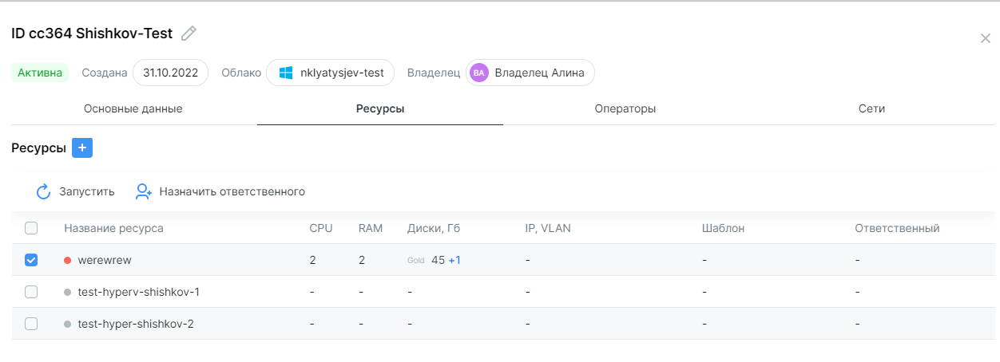
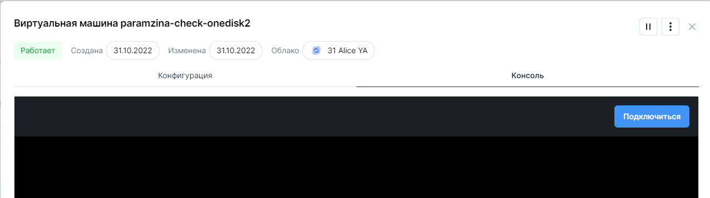
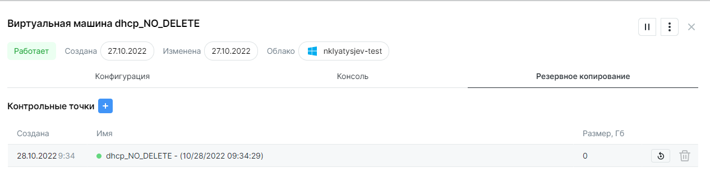

# Работа с виртуальными машинами

## Создание ВМ

!!! Условия
	- Пользователь может создать ВМ только в тех `Подписках`, которые ему доступны. 

	- ВМ можно создать только в подписке. 

	- В подписке должно быть достаточно свободных ресурсов.

	- В подписке должны быть настроены сети.

Создать ВМ можно из раздела **Подписки** или из раздела **Ресурсы**.

В разделе **Подписки**:

1.	Открыть карточку нужной подписки из списка. Подписка должна иметь статус *Активна*. 
2.	Вкладка **Ресурсы**. Кликнуть **+**. В открывшемся меню выбрать **Создать новый**.
 
В разделе **Ресурсы** -> **Виртуальные машины**. В правом верхнем углу кнопка **Добавить ресурс**.
 
Машину можно создать на базе шаблонов, либо создать свою конфигурацию машины на базе `Образов`, доступных в облаке. Образ должен находиться в том же облаке Clouder, где создается машина. Образ из другого облака применить не получится.

Список доступных образов можно посмотреть в разделе **Образы**.
 
Конфигурация машины определяется количеством CPU, RAM, числом, размерами и типами дисков. 

>Обратите внимание, что образы ВМ имеют разные потребности в объемах ресурсов.
 
Машине можно подключить одну из доступных в подписке сетей. Доступность сетей определяет `Глобальный администратор`. Создание и настройка сетей производится штатными инструментами системы виртуализации.

Создание ВМ занимает некоторое время. Узнать о фоновых процессах можно в ленте процессов, открывается по клику на индикатор активных процессов вверху справа рядом с колокольчиком. 

Когда машина будет создана, в **Уведомлениях** (колокольчик справа вверху), появится соответствующее сообщение.

## Изменение ВМ

В разделе **Ресурсы** -> **Виртуальные машины** пользователь может видеть список доступных ему ВМ. При клике на строку открывается карточка ВМ.

Для редактирования параметров CPU, RAM, Сети - нажмите карандаш в углу карточки.

Для изменения/удаления диска, наведите на виджет с диском и нажмите :fontawesome-solid-ellipsis-vertical: и выберите действие — **Удалить** или **Оптимизировать**.

Для каждой ВМ `Владелец` может назначить **Ответственного**. Это пользователь, который будет иметь доступ к управлению и изменению ВМ. Выбирается из `Операторов`, добавленных в выбранную `Подписку`. 

??? "Как назначить ответственного за ВМ"
    Перейдите в раздел **Подписки**. Откройте карточку подписки, где находится ВМ.
    Во вкладке *Ресурсы* в карточке машины выберите чекбоксом необходимые ВМ. Нажмите на **Назначить ответственного**. 

> Ответственный назначается автоматически, при создании ВМ. В дальнейшем его можно изменить.

## Действия с ВМ

!!! Условия
	Пользователь должен иметь доступ к `Подписке`, где находится машина. Это может быть `Владелец` или `Оператор` в статусе `Ответственного` за ВМ. `Глобальный администратор` может видеть и осуществлять все операции со всеми машинами вне зависимости от подписок.

Операции с машинами доступны в карточке машины. Найти машину и открыть картоку можно в разделе **Ресурсы** -> **Виртуальные машины** и в разделе **Подписки** в карточке подписки. 
 
Доступны следующие операции с существующими машинами: 

1) Запуск,
2) Остановка.

!!! Ограничение
	Действия по запуску и остановке недоступны для машин в состоянии *Ошибка*.

Процессы по запуску и остановке ВМ отражаются в ленте процессов. По результату завершения процесса в центр уведомлений поступает сообщение со статусом.

## Доступ к консоли ВМ

!!! Условия
	- Машина должна находиться в статусе *Работает*,

	- Должна быть настроена сетевая связность с **Clouder**.

Операции с машинами доступны в карточке машины. Найти машину и открыть картоку можно в разделе **Ресурсы** -> **Виртуальные машины** и в разделе **Подписки** в карточке подписки. 

Откройте вкладку *Консоль* и нажмите **Подключиться**.

**Clouder** позволяет использовать буфер обмена для копирования информации в консоль машины.

## Создание и восстановление из контрольной точки

!!! Условия
	Пользователь должен иметь доступ к `Подписке`, где находится машина. Это может быть `Владелец` или `Оператор` в статусе `Ответственного` за ВМ. `Глобальный администратор` может видеть и осуществлять все операции со всеми машинами вне зависимости от подписок.

Для облаков на базе ***Hyper-V*** и ***VMware Cloud Director*** есть возможность создавать контрольные точки и восстанавливать машину из созданной контрольной точки.

Операции с машинами доступны в карточке машины. Найти машину и открыть картоку можно в разделе **Ресурсы** -> **Виртуальные машины** и в разделе **Подписки** в карточке подписки. 

В карточке машины выберите вкладку ***Резервное копирование***. Кликните **+**, чтобы добавить контрольную точку. 

Создание контрольной точки занимает некоторое время. Узнать о фоновых процессах можно в ленте процессов. Когда контрольная точка будет создана, в **Уведомлениях** (колокольчик справа вверху), появится соответствующее сообщение.

!!! Внимание
	Контрольная точка занимает дисковое пространство. Сейчас Clouder ***НЕ*** учитывает занятый объем диска в квоте подписки.

Аналогично происходит процесс восстановления машины из контрольной точки: во вкладке ***Резервное копирование*** выберите иконку восстановления в конце строки нужной контрольной точки.

## Создание шаблона

!!! Условия
	
	Пользователь должен иметь доступ к `Подписке`, где находится машина. Это может быть `Владелец` или `Оператор` в статусе `Ответственного` за ВМ. `Глобальный администратор` может видеть и осуществлять все операции со всеми машинами вне зависимости от подписок.

	Шаблон может быть создан и применен в том же облаке, где размещена машина.

В разделе **Шаблоны** кликните **Создать шаблон**, заполните форму. 

Шаблон будет доступен во всех подписках данного облака Clouder. Шаблоны отображаются в меню создания новой ВМ на базе шаблона.

`Шаблон` представляет собой образ машины, сохраненный в облаке, и конфигурацию (CPU, RAM и диски). При создании шаблона копирования информации, хранящейся на действующей машине, не происходит.