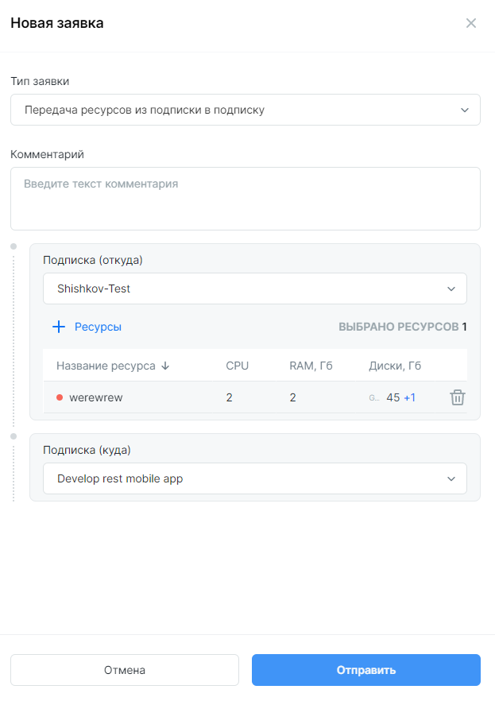

# Перемещение машин

## Перемещение машин без подписок

!!! Права
	Для выполнения действий потребуются права `Глобального администратора`.
 
При подключении **Clouder** в облаке уже могут работать виртуальные машины. **Clouder** обнаружит машины, диски, образы и сети. Списки обнаруженных ресурсов можно найти в соответствующих разделах.

Создайте `подписку`, воспользовавшись инструкцией предыдущего раздела.

После создания `подписки`. В разделе **Заявки** выберите **Создать заявку** и тип `Перемещение ресурсов в подписку`. В выпадающем меню выберите `подписку`, к которой будут прикрепляться ресурсы. **+ Ресурсы** и выберите одну или несколько машин, из числа нераспределенных по подпискам. 

В списке появится заявка в статусе *Новая*. Кликните на `завку`, чтобы открыть карточку заявки, кликните **Согласовать**.
 
В разделе **Подписки** откройте карточку соответствующей подписки, проверьте, что ресурсы теперь прикреплены к подписке.

Конфигурация машины будет учтена в квоте `подписки`, т.е. соответствующий объем CPU, RAM и дискового пространства будет отображен, как используемый в статус баре.

## Перемещение машин из подписки в подписку

!!! Условия
	Для выполнения действий потребуются права `Глобального администратора` или `Владельца` обеих подписок.

	`Подписки` должны находиться в одном облаке.

	В `подписке (куда)` должно быть достаточно свободных ресурсов.

В разделе **Заявки** создайте заявку с типом `Передача ресурсов из подписки в подписку`. Выберите `подписку (откуда)`, в которой находится машина или машины. Кликните на **+ Ресурсы** и выберите ресурсы, доступные для перемещения.

Выберите `подписку (куда)`. Завершите передачу ВМ в другую подписку.

